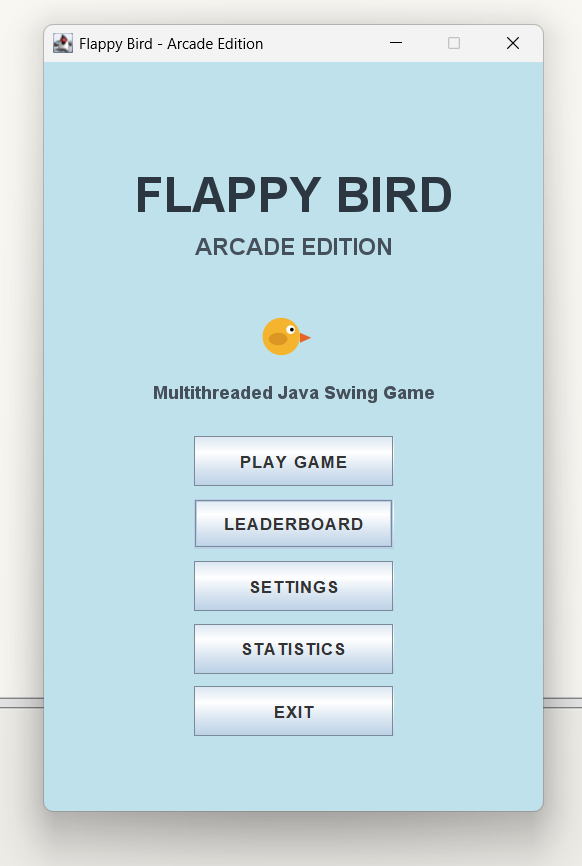
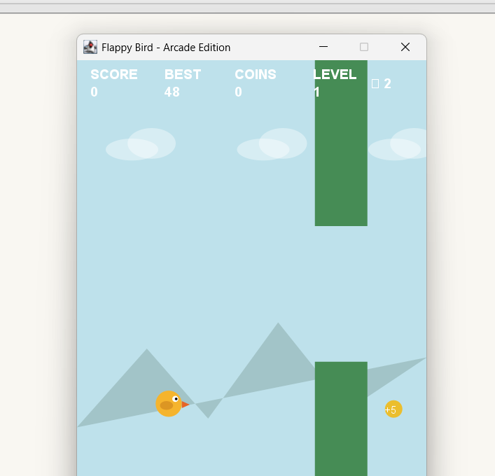
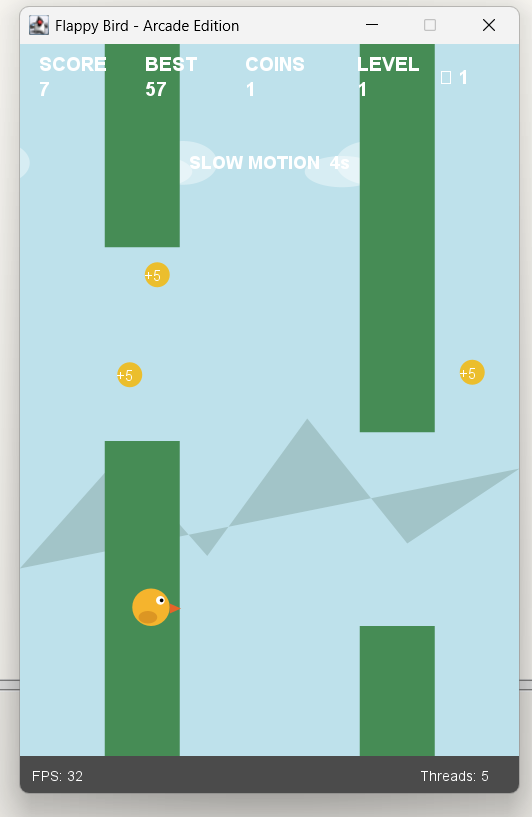
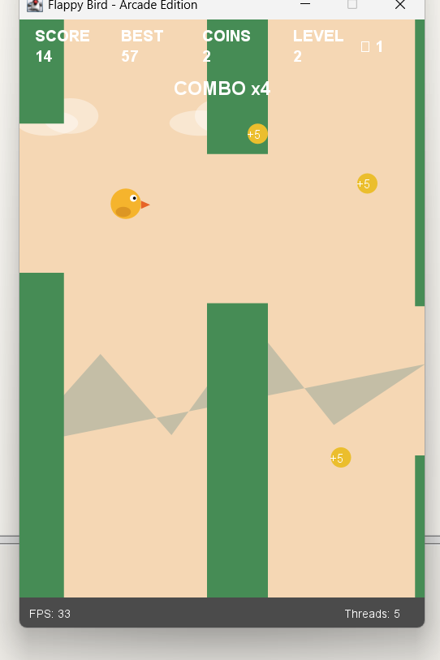

# 🐦 Flappy Bird — Arcade Edition

A Java-based Flappy Bird game developed using **Java Swing** and the **BlueJ development environment**. The project combines interactive gameplay, Object-Oriented Programming, Java multithreading, collision detection, scoring, power-ups, and persistent game statistics.

The game was designed as a multithreaded Java application where different game operations are handled independently using multiple threads.

---

## 🎮 Game Overview

Flappy Bird — Arcade Edition is an interactive arcade-style game where the player controls a bird and navigates it through randomly generated pipes.

The player must avoid collisions, collect coins, use power-ups, maintain combos, and achieve the highest possible score.

As the score increases, the game becomes progressively more challenging through increased pipe speed and reduced pipe gaps.

---

## 🛠️ Technologies Used

- **Java**
- **Java Swing**
- **Multithreading**
- **Object-Oriented Programming (OOP)**
- **Event-Driven Programming**
- **File Handling**
- **BlueJ Development Environment**

---

## ✨ Features

### 🎮 Core Gameplay

- Interactive Flappy Bird gameplay
- Bird movement with gravity-based physics
- Flap controls using keyboard input
- Randomly generated pipes
- Collision detection
- Game-over conditions
- Restart and return-to-menu functionality

### ❤️ Lives System

- Player starts with **3 lives**
- Colliding with obstacles reduces a life
- Temporary invulnerability is provided after losing a life
- Shield power-up can protect the player from a collision
- Extra Life power-up can increase the number of lives

### 🪙 Coin System

- Collectible coins appear during gameplay
- Each collected coin awards **+5 points**
- Total collected coins are tracked
- Coin statistics are saved for future games

### 🔥 Combo System

- Consecutive successful actions build a combo
- Combos are displayed during gameplay
- A higher combo can provide additional score rewards
- Combo timing encourages continuous gameplay

### ⚡ Power-Ups

The game includes four different power-ups:

| Power-Up | Effect |
|---|---|
| 🛡️ Shield | Protects the bird from one collision |
| `2x` Double Score | Doubles score gained from scoring actions |
| `T` Slow Motion | Temporarily slows down gameplay |
| `+` Extra Life | Adds an additional life |

Timed power-ups display their remaining duration on the HUD.

### 📈 Level & Difficulty System

The game dynamically increases its difficulty as the player's score increases.

- Levels increase progressively
- Pipe movement speed increases
- Pipe gaps become smaller
- Maximum level: **8**
- Minimum pipe gap: **115 pixels**
- Maximum pipe speed: **8**

This creates progressively more challenging gameplay.

### 🏆 Scoring & High Score

- Score increases when successfully passing pipes
- Coins provide additional points
- Double Score power-up increases scoring
- High score is tracked
- New high scores are highlighted on the Game Over screen

### 📊 Statistics

The game keeps track of:

- Games played
- Highest score
- Best level
- Total pipes passed
- Total coins collected

These statistics are stored and loaded using a local statistics file.

### ⏸️ Pause & Resume

The game can be paused during gameplay and resumed without restarting the current game.

**Press `P`** to pause or resume.

### 🔊 Sound Settings

The game includes a sound setting that can be enabled or disabled.

The sound system uses Java's system beep functionality for game events.

### 📺 Multiple Game Screens

The game includes separate screens for:

- Main Menu
- Gameplay
- Pause
- Game Over
- Leaderboard
- Settings
- Statistics

---

## 🧵 Multithreading

One of the main objectives of this project is to demonstrate **multithreading in Java**.

The game uses multiple threads to independently handle different operations.

### Threads Used

| Thread | Responsibility |
|---|---|
| Bird Thread | Bird physics, gravity, animation and collision checks |
| Pipe Thread | Pipe movement, scoring and pipe generation |
| Coin Thread | Coin movement and coin generation |
| Power-Up Thread | Power-up movement, generation and timers |
| Repaint Thread | Continuous screen repainting and FPS monitoring |

The game therefore runs with **5 concurrent threads** during gameplay.

This allows different game operations to be processed independently while maintaining smooth gameplay.

---

## 🖥️ Graphical User Interface

The graphical interface is developed using **Java Swing**.

The game includes:

- Interactive buttons
- Keyboard controls
- Custom game rendering
- Animated bird
- Pipes
- Coins
- Power-ups
- Game HUD
- Score display
- Level display
- Lives display
- Combo display
- FPS and thread monitoring

---

## 📸 Screenshots

### 🏠 Main Menu



The main menu provides access to the different sections of the game, including gameplay, leaderboard, settings, statistics, and exit.

---

### 🎮 Gameplay



The gameplay screen displays the bird, pipes, coins, score, best score, level, lives, FPS, and active game information.

---

### ⚡ Slow Motion Power-Up



The Slow Motion power-up temporarily reduces the game speed and displays the remaining duration on the screen.

---

### 🔥 Combo System



The combo system rewards consecutive successful actions and displays the current combo during gameplay.

---

### 🏆 New High Score


The Game Over screen displays the final score, best score, collected coins, and highlights a new high score when achieved.

---

## 🎯 Controls

| Key | Action |
|---|---|
| `Space` | Flap |
| `W` | Flap |
| `P` | Pause / Resume |
| `R` | Restart after Game Over |
| `Esc` | Return to Main Menu |
| `S` | Toggle Sound in Settings |

---

## 💾 Data Persistence

The game stores important statistics in a local file:

```text
game_stats.txt
